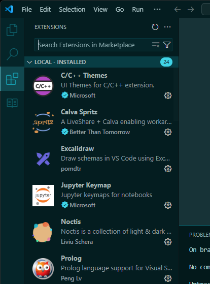
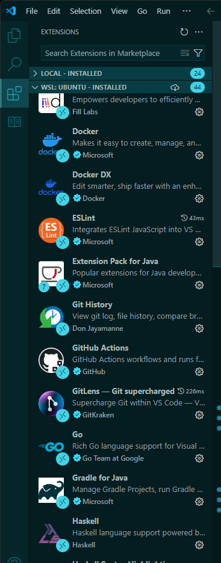
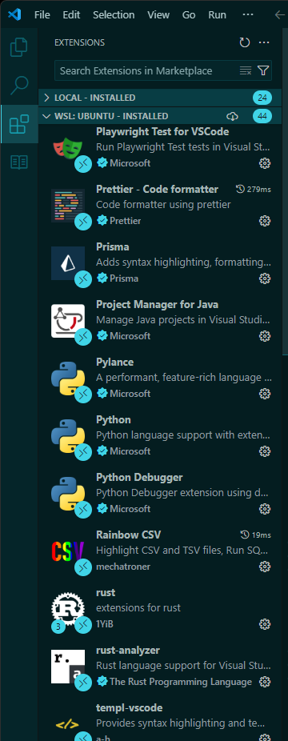
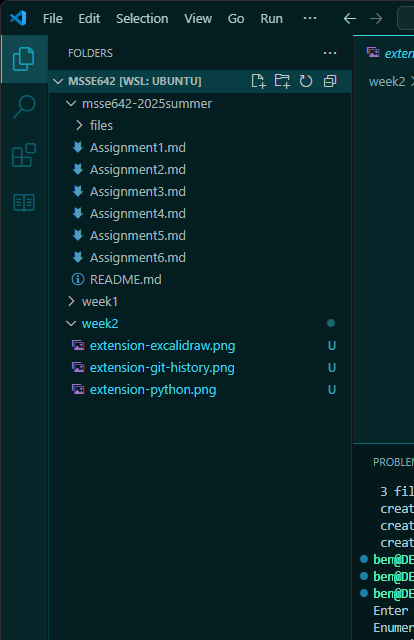

# 📝 **Part I: Configure Visual Studio Code**

## Extensions:

*(Apologies for the multiple screenshots, but I already have a lot of extensions in my environment)*

<div style="display: flex; justify-content: space-between;">
  <p style="flex: 1; text-align: center;">Excalidraw</p>
  <p style="flex: 1; text-align: center;">Git History</p>
  <p style="flex: 1; text-align: center;">Python</p>
</div>
<div style="display: flex;">
  
  
  
</div>

# 📖 **Part II: Current Working Directory**



# 📖 **Part III: What Makes a Good Readme?**

A **README** file written by the author(s) or maintainer(s) of a software project is that is a user's first introduction to that project. It is essential in helping others understand, set up, and use the project.

Below is a comprehensive guide on what makes an excellent README, along with Markdown examples of how each element can be incorporated:### 2. **Table of Contents**

## 📚 Elements:

- [Project Title and Brief Description](#1-project-title-and-brief-description)
- [Table of contents](#2-table-of-contents)
- [Installation](#3-installation)
- [Usage](#4-usage)
- [Configuration](#5-configuration)
- [Dependencies](#6-dependencies)
- [Testing](#7-testing)
- [Contributing](#8-contributing)
- [License](#9-license)

---

## 🔑 **Key Elements of a Good README**

### 1. **Project Title and Brief Description**

Titles help users find the information they are looking for. Without them, users would have to read the entire readme, which may not be necessary when they are looking for something specific.

Example:

```markdown
# 🚀 Awesome Project

**Awesome Project** helps developers effortlessly manage tasks, streamline workflow, and increase productivity through automation.
```

---

### 2. **Table of Contents**

A table of contents help users skip to the information they need faster. It also helps organize the readme into logical sections.

Example:

```markdown
## 📚 Table of Contents

- [Key Elements of a Good README](#-key-elements-of-a-good-readme)
- [Installation](#-installation)
```

---

### 3. **Installation**

Software installation can be quite difficult, especially when users may be using different operating systems and architectures. While it could be a simple, one-line installation command, it could be much more complex with many steps. It is best to let the user know these complexities up front.

Example:

```markdown
## 🔧 Installation

Clone this repository and navigate to the project folder:

```bash
git clone https://github.com/username/awesome-project.git
cd awesome-project
```

Install dependencies:

```bash
npm install
```

---

### 4. **Usage**

Not all software has the equivalent of a man page or a cli-style help command. The next best thing is the documentation, and added that information (briefly) in the readme is a great start. 

Example:

```markdown
## 🛠️ Usage

Run the application with the following command:

```bash
npm start
```

Access the app in your browser at [http://localhost:3000](http://localhost:3000).

Here's a quick demo:


---

### 5. **Configuration**

Not all projects will require configuration, but the readme is a good place to put that documentation if needed. 

Example:

```markdown
## ⚙️ Configuration

Configuration settings can be adjusted in `config.json`:

| Parameter | Type | Default | Description |
|-----------|------|---------|-------------|
| `port`    | `int` | `3000` | Server port number |
| `verbose` | `bool` | `false` | Enable verbose logging |
```

---

### 6. **Dependencies**

A project can quickly start having issues with peer dependencies. One dependency could require an older version while a different dependency could require a newer version of the same project. This issue could lead to the project being unusable. Best to let users know upfront what versions of the dependencies the project has so they can decide if the software is sufficient for their use case.

Example:

```markdown
## 📦 Dependencies

- **Express.js** (`^4.17.1`): Web framework for Node.js
- **React** (`^18.0.0`): Frontend UI library
- **Mongoose** (`^6.0.0`): MongoDB ODM
```

---

### 7. **Testing**

Letting the user know how to test the project is a good idea. 

Example:

```markdown
## ✅ Testing

Run unit tests using Jest:

`npm test`

Coverage reports are generated automatically and stored in `/coverage`.
```

---

### 8. **Contributing**

If users have access to view the code, it is wise open a venue to let them help maintain the software. Creating specific instructions on how to contribute to the software will help them and the other maintainers accept or reject changes.

Example:

```markdown
## 🤝 Contributing

We warmly welcome contributions! Please follow these steps:

1. Fork the repository
2. Create a new branch: `git checkout -b my-feature`
3. Commit your changes: `git commit -m "Add feature XYZ"`
4. Push your branch: `git push origin my-feature`
5. Open a Pull Request

> **Note:** All contributions must pass CI tests before merging!
```

---

### 9. **License**

Some users might want to create something with the software and then sell it. Hopefully no users would want to sell the software unaltered. In either case, creating a license tells users what they can and cannot due with the software.

Example:

```markdown
## 📃 License

Distributed under the MIT License. See [LICENSE](LICENSE) for more information.
```

---

