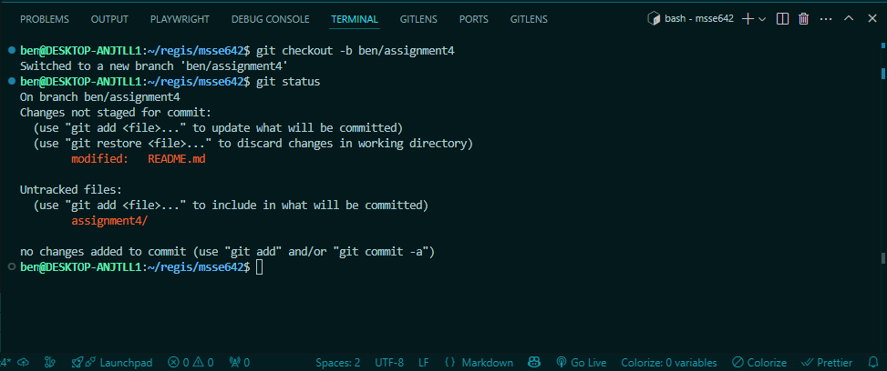
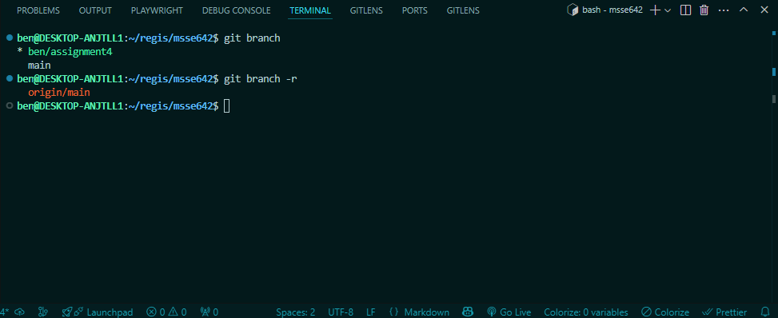
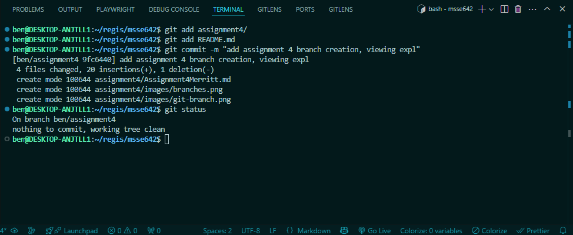
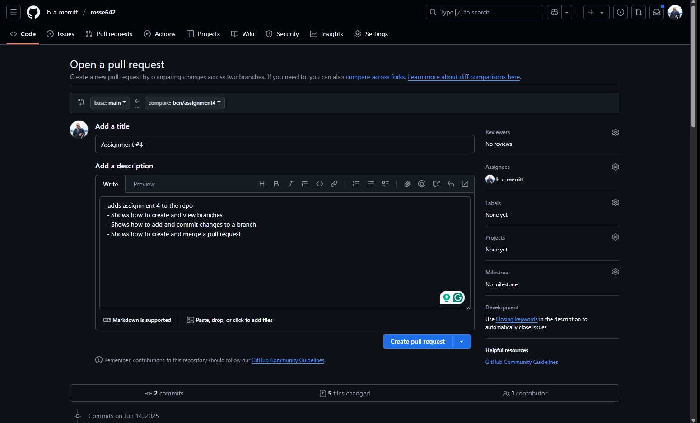

# Git Branching

## Creating a new Branch

```Bash
git checkout -b <feature branch name>
```



## Viewing Branches

```Bash
git branch # see all local branches
git branch -r # see the remote branches
```



## Commiting Changes to a Branch

```Bash
git add <File names...> # add files to staging area
git commit -m "<commit message>" # commit the changes 
```



## Creating and Merging a Pull Request

```Bash
git push origin <branch name>
```

